# Weather Predictor Architecture

## Original PatchTST Model Architecture

```mermaid
graph TD
    A["Input Data<br/>7 Channels × 512 Time Steps"] --> B["RevIN Normalization"]
    B --> C["ReplicationPad1d<br/>(0, 8)"]
    C --> D["TSTiEncoder Backbone"]

    %% TSTiEncoder Components
    D --> D1["Patch Embedding<br/>Linear(16→128)"]
    D1 --> D2["Dropout (0.2)"]
    D2 --> D3["TSTEncoder<br/>3 Layers"]

    %% Encoder Layers (showing one layer structure)
    D3 --> L1["TSTEncoderLayer 1"]
    L1 --> L1_attn["MultiheadAttention<br/>W_Q, W_K, W_V → ScaledDotProductAttention"]
    L1_attn --> L1_drop1["Dropout (0.2)"]
    L1_drop1 --> L1_norm1["BatchNorm1d (128)"]
    L1_norm1 --> L1_ff["Feed-Forward<br/>Linear(128→256) → GELU → Dropout → Linear(256→128)"]
    L1_ff --> L1_drop2["Dropout (0.2)"]
    L1_drop2 --> L1_norm2["BatchNorm1d (128)"]

    L1_norm2 --> L2["TSTEncoderLayer 2<br/>(Same structure)"]
    L2 --> L3["TSTEncoderLayer 3<br/>(Same structure)"]

    %% Head
    L3 --> H["Flatten_Head"]
    H --> H1["Flatten<br/>(start_dim=-2, end_dim=-1)"]
    H1 --> H2["Linear<br/>(8192→336)"]
    H2 --> H3["Dropout (0.0)"]

    H3 --> F["Final Output<br/>7 Channels × 336 Time Steps"]

    %% Styling
    classDef inputStyle fill:#e1f5fe,stroke:#01579b,stroke-width:2px
    classDef outputStyle fill:#c8e6c9,stroke:#2e7d32,stroke-width:2px
    classDef encoderStyle fill:#fff3e0,stroke:#ef6c00,stroke-width:2px
    classDef layerStyle fill:#f3e5f5,stroke:#7b1fa2,stroke-width:2px
    classDef headStyle fill:#fce4ec,stroke:#c2185b,stroke-width:2px

    class A inputStyle
    class F outputStyle
    class D,D1,D2,D3 encoderStyle
    class L1,L2,L3,L1_attn,L1_drop1,L1_norm1,L1_ff,L1_drop2,L1_norm2 layerStyle
    class H,H1,H2,H3 headStyle
```

## Physics-Integrated PatchTST Model Architecture

```mermaid
graph TD
    A["Input Data<br/>23 Channels × 512 Time Steps"] --> B["RevIN Normalization"]
    B --> C["Long Channel Encoder"]
    B --> D["Short Channel Encoder"]

    %% Long Channel Encoder components
    C --> C1["ReplicationPad1d (0,12)"]
    C1 --> C2["Patch Embedding<br/>Linear(24→128)"]
    C2 --> C3["23 × CustomMultiheadAttention<br/>W_Q, W_K, W_V → ScaledDotProductAttention<br/>→ FeedForward(GELU) → LayerNorm"]
    C3 --> C4["Flatten + Linear<br/>5376→336"]

    %% Short Channel Encoder components
    D --> D1["ReplicationPad1d (0,6)"]
    D1 --> D2["Patch Embedding<br/>Linear(6→128)"]
    D2 --> D3["23 × CustomMultiheadAttention<br/>W_Q, W_K, W_V → ScaledDotProductAttention<br/>→ FeedForward(GELU) → LayerNorm"]
    D3 --> D4["Flatten + Linear<br/>11008→336"]

    %% Cross-Group Attention
    C4 --> E["Cross-Group Attention"]
    D4 --> E
    E --> E1["Channel Projection<br/>Linear(1→64) + LayerNorm"]
    E1 --> E2["CustomMultiheadAttention<br/>Cross-Attention between Long & Short"]
    E2 --> E3["Feed-Forward Network<br/>Linear(256) + GELU + Dropout"]
    E3 --> E4["Output Projection<br/>Linear(64→1)"]

    E4 --> F["Final Output<br/>23 Channels × 336 Time Steps"]

    %% Styling
    classDef inputStyle fill:#e1f5fe,stroke:#01579b,stroke-width:2px
    classDef outputStyle fill:#c8e6c9,stroke:#2e7d32,stroke-width:2px
    classDef longStyle fill:#fff3e0,stroke:#ef6c00,stroke-width:2px
    classDef shortStyle fill:#fce4ec,stroke:#c2185b,stroke-width:2px
    classDef crossStyle fill:#f3e5f5,stroke:#7b1fa2,stroke-width:2px

    class A inputStyle
    class F outputStyle
    class C,C1,C2,C3,C4 longStyle
    class D,D1,D2,D3,D4 shortStyle
    class E,E1,E2,E3,E4 crossStyle
```

## Proposed Enhancement Architecture (Component View)

### Architecture Enhancement Explanation

This diagram illustrates how the **Physics-Integrated PatchTST** extends the original architecture with three key innovations:

#### 🔵 **Existing Components (Blue)** - Reused from Original PatchTST
These proven components are retained and replicated across channel groups:

1. **RevIN Normalization**: Instance normalization for stable training
2. **ReplicationPad1d**: Temporal padding for patch alignment
3. **Patch Embedding (Linear Transform)**: Converts time patches to feature space
4. **MultiheadAttention**: Core self-attention mechanism for temporal dependencies
5. **Feed-Forward Network**: Non-linear transformations with GELU activation
6. **Flatten Head**: Converts encoded features to predictions

#### 🟢 **Enhancement Components (Green)** - Novel Contributions

**1. Channel Grouping by Physics**
- **Innovation**: Separates weather variables by their temporal characteristics
- **Benefit**: Allows specialized processing for different variable types
  - **Long Channel Group**: Optimized for smooth, gradual changes (temperature, pressure, average wind)
  - **Short Channel Group**: Optimized for rapid, sudden changes (rain events, gusts, dew point shifts)
- **Impact**: Better captures the inherent physics of weather phenomena

**2. Per-Channel Attention**
- **Innovation**: Independent attention mechanisms for each channel within a group
- **Benefit**: Each variable learns its own temporal patterns without interference
- **Impact**: More precise modeling of individual weather variable dynamics

**3. Cross-Group Attention**
- **Innovation**: Novel fusion mechanism that exchanges information between channel groups
- **Benefit**: 
  - Captures correlations between slow and fast-changing variables
  - Enables interaction patterns like "sudden rain affects gradual temperature change"
  - Creates a unified representation from diverse temporal scales
- **Impact**: Holistic weather understanding that respects both short-term events and long-term trends

### Key Benefits of the Enhanced Architecture

| Aspect | Original PatchTST | Physics-Integrated Enhancement |
|--------|------------------|-------------------------------|
| **Channel Processing** | Uniform for all variables | Grouped by temporal characteristics |
| **Patch Strategy** | Single fixed size | Variable-length patches per group |
| **Attention Scope** | Global across channels | Per-channel + cross-group fusion |
| **Physics Awareness** | Implicit | Explicit via grouping strategy |
| **Scalability** | Limited by channel count | Efficient parallel group processing |

### Why This Design Works

1. **Respects Weather Physics**: Different weather phenomena operate on different timescales
2. **Leverages Proven Components**: 80% reuse of validated PatchTST architecture
3. **Adds Strategic Intelligence**: 20% enhancement through grouping and fusion
4. **Maintains Efficiency**: Parallel processing of groups enables GPU optimization
5. **Improves Interpretability**: Clear separation of slow vs fast dynamics

## Architecture Details

### Input Processing
- **Input Shape**: 23 weather channels × 512 time steps
- **RevIN Normalization**: Reversible Instance Normalization for stable training

### Dual Channel Encoders

#### Long Channel Encoder
- **Purpose**: Captures long-term trends in weather variables
- **Patch Configuration**: patch_len=24, stride=12 (50% overlap)
- **Target Variables**: rain (mm), T (degC), Tpot (K), wv (m/s)
- **Architecture**:
  - Replication padding to handle stride overlap
  - Patch embedding: 24 time steps → 128 features
  - 23 parallel attention heads per channel
  - Custom multihead attention with Q/K/V projections
  - Feed-forward network with GELU activation
  - Final projection: 5376 → 336 (prediction length)

#### Short Channel Encoder
- **Purpose**: Captures rapid variations and high-frequency changes
- **Patch Configuration**: patch_len=6, stride=6 (no overlap)
- **Target Variables**: raining (s), Tdew (degC), max. wv (m/s)
- **Architecture**:
  - Replication padding for patch alignment
  - Patch embedding: 6 time steps → 128 features
  - 23 parallel attention heads per channel
  - Same attention architecture as long channel
  - Final projection: 11008 → 336 (prediction length)

### Cross-Group Attention
- **Purpose**: Fuses information from long and short channel encoders
- **Mechanism**:
  - Channel-wise projection: 1 → 64 dimensions
  - Cross-attention between long and short channel features
  - Feed-forward network for feature refinement
  - Output projection back to channel dimension

### Output
- **Shape**: 23 channels × 336 prediction time steps
- **Optimization**: Loss computed only on 7 target indices (4 long + 3 short)
- **Full Output**: All 23 channels predicted for complete weather forecasting

## Key Innovations

1. **Physics-Based Grouping**: Separates variables by temporal characteristics
2. **Variable-Length Patching**: Different patch sizes for different variable types
3. **Per-Channel Attention**: Independent attention for each weather variable
4. **Cross-Group Fusion**: Attention-based integration of long and short-term patterns
5. **Selective Optimization**: Full model output with targeted loss computation

## Training Configuration
- **Optimizer**: AdamW (lr=0.0001, weight_decay=1e-4)
- **Scheduler**: OneCycleLR
- **Loss**: MSE on target variables only
- **Batch Size**: 64
- **Sequence Length**: 512 (input), 336 (prediction)